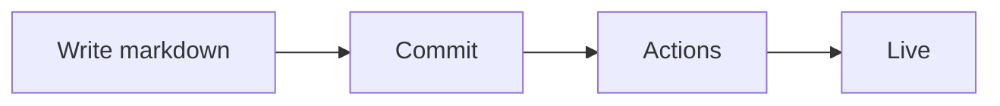

# geongupark.github.io

A black-and-white, typography-first personal tech blog. Commit a markdown file and it ships.

```
Astro 7 · Pagefind (search) · giscus (comments) · Expressive Code · GitHub Pages
```

## Getting started

```bash
npm install
npm run dev        # http://localhost:4321
```

| Command | What it does |
|---|---|
| `npm run dev` | Dev server (search is inert here — see below) |
| `npm run build` | Static build plus the Pagefind search index |
| `npm run preview` | Serve the build — **this is where search works** |
| `npm run new "Title"` | Scaffold a new post |
| `npm run clean` | Remove build output and caches |

## Writing a post

Any markdown (`.md` / `.mdx`) file under `src/content/blog/` is a post.

```yaml
---
title: "Chasing Kafka consumer lag"
description: "One line, used in the list, search results and the OG card"
date: 2026-09-02
category: backend            # exactly one; a new name creates the category
tags: [kafka, monitoring]    # any number; each creates a tag page
draft: false                 # true keeps it out of the deployed site
updated: 2026-09-10          # optional
series: "Running Kafka"      # optional; groups posts with the same value
---
```

Frontmatter is validated by the schema in `src/content.config.ts`. A typo **fails the
build**, so a malformed post never reaches the site.

### Categories and tags

There is nothing to register. Write a new name in `category` or `tags` and
`/categories/<name>` and `/tags/<name>` are generated at build time.

### Code blocks

````markdown
```ts title="src/utils/posts.ts" {3-5}
// file name, lines 3-5 highlighted, copy button included
```
````

## Editing in the browser

[Sveltia CMS](https://github.com/sveltia/sveltia-cms) is served at
[`/admin`](https://geongupark.github.io/admin). It is a static page that talks to the
GitHub API from your browser — publishing a post is a commit, which triggers the deploy
workflow like any other push.

Access is decided by GitHub, not by this repo: signing in requires a token with write
access here. Anyone can open `/admin`, but without that access they cannot read or change
anything. `public/admin/config.yml` is public and holds no secrets.

### Try it with no setup

```bash
npm run dev
```

Open `http://localhost:4321/admin` in Chrome or Edge and choose **Work with Local
Repository**. It edits the files in this checkout directly through the File System Access
API — no login, no OAuth, nothing deployed. Changes land in your working tree, and you
commit them yourself.

### Signing in on the live site

Open [`https://geongupark.github.io/admin`](https://geongupark.github.io/admin) and pick
**Sign In Using Access Token**. Generate a fine-grained personal access token on GitHub
scoped to this repository with **Contents: read and write**, then paste it in. Nothing
else to deploy.

The **Sign In with GitHub** button is a nicer flow but needs an OAuth relay, because
GitHub will not hand a token to a static page. If you want it, deploy
[Sveltia CMS Authenticator](https://github.com/sveltia/sveltia-cms-auth) to Cloudflare
Workers' free tier:

1. Deploy the worker and note its URL.
2. Create a GitHub OAuth app under **Settings → Developer settings → OAuth Apps** with the
   callback URL set to `https://<worker>.workers.dev/callback`.
3. Put the client ID and secret into the worker's environment variables, with
   `ALLOWED_DOMAINS` set to `geongupark.github.io`.
4. Uncomment `base_url` in `public/admin/config.yml` and point it at the worker.

### Notes

- **Drafts** default to on. A post stays out of the deployed site until you turn it off.
- **Images** dropped into the editor are committed to `public/uploads/` and referenced as
  `/uploads/<file>`.
- **Category** is a free text field on purpose: typing a name that does not exist yet
  creates that category page on the next build. Same for tags.
- The **About page** is editable under Singletons. Other pages under `src/pages/` can be
  added to `singletons` in the config the same way.
- The body field is **raw Markdown only** (`modes: [raw]`). The rich text editor rewrites
  what it does not recognise — it escaped the backticks of a ```` ```mermaid ```` fence into
  `` \` ``, which then rendered as literal text on the site. Paste Markdown as Markdown.
- The CMS is pinned to an exact version in `public/admin/index.html` so the editor cannot
  break on its own. Bump it deliberately.

## Diagrams

A ```` ```mermaid ```` fence in a post becomes a diagram:

````markdown

````

It is rendered to inline SVG at build time by
[beautiful-mermaid](https://github.com/beautiful-diagrams/beautiful-mermaid), which needs
no browser, so:

- a page with a diagram still ships **no JavaScript** for it, and it paints with the
  first render rather than after a script loads;
- every color in the SVG is a CSS custom property (`--diagram-*` in
  `src/styles/tokens.css`), so **one file serves both themes** and the theme toggle
  repaints diagrams instantly.

`title="..."` after the language adds a caption and the SVG's accessible name.

Supported: `flowchart` / `graph`, `sequenceDiagram`, `stateDiagram-v2`, `classDiagram`,
`erDiagram`, `xychart-beta`. Not supported: `pie`, `gantt`, `gitGraph`, `mindmap`,
`journey`, `timeline`, `quadrantChart` — those fences stay ordinary code blocks instead
of failing the build. This is a compact reimplementation rather than mermaid.js itself,
so complex diagrams may lay out differently than on mermaid.live.

## Adding a page (CV and friends)

A markdown file under `src/pages/` becomes a page.

```markdown
---
layout: ../layouts/PageLayout.astro
title: CV
eyebrow: Page
description: Experience and background
---

## Experience
...
```

To show it in the menu, add one line to `NAV` in `src/config.ts`.

## Search

[Pagefind](https://pagefind.app) builds a static index at build time — no server, no
third-party service. `⌘K` or `/` opens the dialog.

> The index is created during `npm run build`, so **search returns nothing under
> `npm run dev`**. Use `npm run build && npm run preview` to try it.

## Comments (giscus)

1. Repository **Settings → General → Features → Discussions**
2. Create a `Comments` category in Discussions (the Announcement format works well)
3. Enter this repository at [giscus.app](https://giscus.app) to get `repoId` and `categoryId`
4. Fill them into `GISCUS` in `src/config.ts`

Until then the post footer shows a short setup note instead of the widget.

## Deploying

Pushing to `master` runs `.github/workflows/deploy.yml`, which builds the site and
publishes it to GitHub Pages.

One-time setup: **Settings → Pages → Build and deployment → Source** must be set to
**GitHub Actions**.

## Customizing

| To change | Edit |
|---|---|
| Title, intro, menu, social links | `src/config.ts` |
| Color, type, spacing (design tokens) | `src/styles/tokens.css` |
| Rendered markdown typography | `.prose` in `src/styles/global.css` |
| Code block theme | `expressiveCode` in `astro.config.mjs` |
| OG card design | `src/pages/og/[...slug].png.ts` |

## Layout

```
src/
├─ config.ts            site settings (title, menu, giscus)
├─ content.config.ts    post frontmatter schema
├─ content/blog/        ← every post lives here
├─ pages/
│  ├─ index.astro       home
│  ├─ posts/            archive, pagination, post body
│  ├─ categories/       index and per-category archives
│  ├─ tags/             index and per-tag archives
│  ├─ og/               per-post OG images, generated at build
│  ├─ about.md          ← this is how a page is added
│  ├─ rss.xml.js        feed
│  └─ 404.astro
├─ layouts/             Base and Page
├─ components/          Header, Footer, Search, TOC, Comments, …
├─ styles/              tokens.css, global.css
└─ utils/posts.ts       sorting, grouping, reading time, related posts
```

## What's included

Browser-based editor at `/admin` · search (`⌘K`) · comments · mermaid diagrams · categories · tags · series · related posts · prev/next ·
table of contents with scroll spy · dark mode · RSS · sitemap · robots.txt ·
generated OG images · JSON-LD · reading time · drafts · copy button on code blocks ·
404 · keyboard navigation · skip link

## License

Content under `src/content/` is © the author. The site code is free to reuse.
